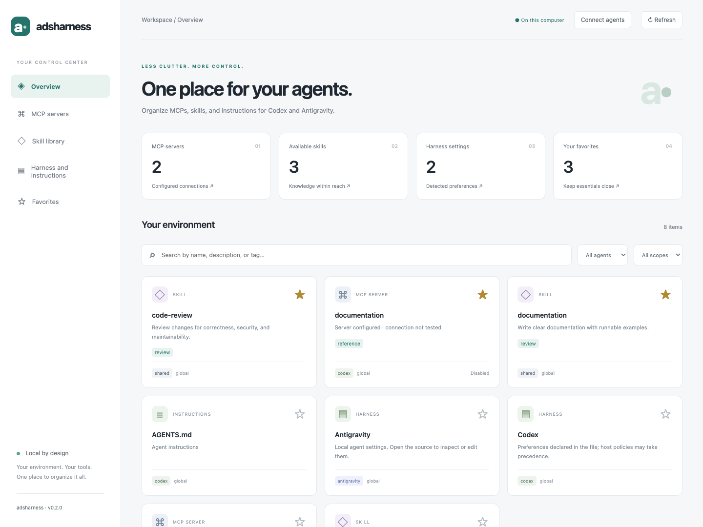
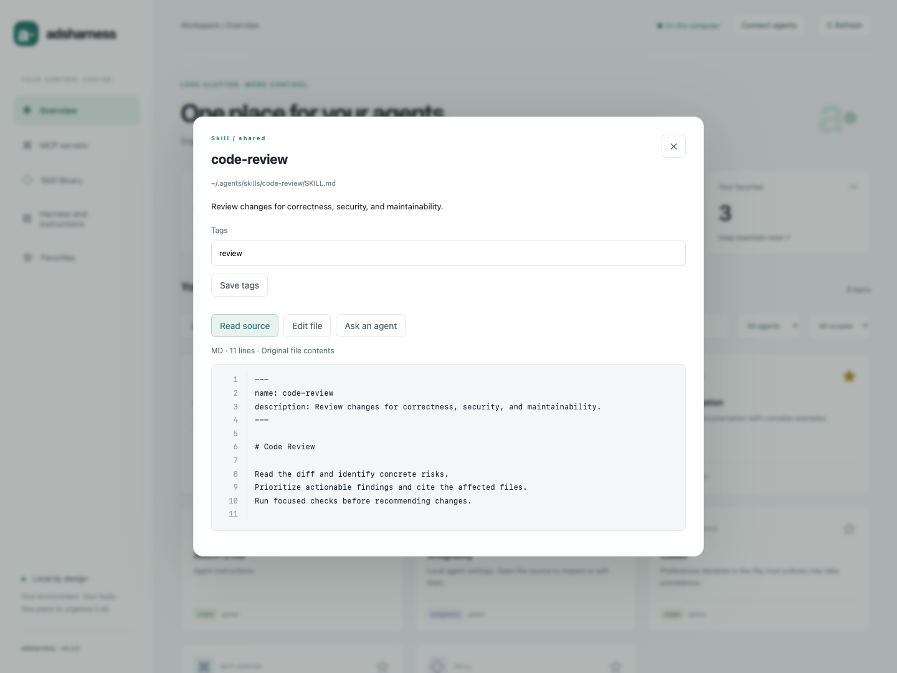

# adsharness

A local workspace for organizing MCPs, skills, and instructions for Codex and Antigravity.

**Status: local preview (0.2.0).** The inventory and editor use only the Python standard library. Optional AI editing uses your authenticated Codex or Antigravity CLI. All application copy and project documentation are in English.

## Screenshots

Screenshots use synthetic demo data and contain no personal configurations or credentials.

**Organize MCP servers, skills, and harness settings in one place.**



**Read original skill files in the built-in source viewer.**



## Getting started

Requires Python 3.11 or later. Run these commands from the cloned repository using your preferred Python environment. The examples use `python`; substitute `python3` or `py` if that is your interpreter's command.

```text
python -m pip install .
python -m adsharness
```

Open the local URL printed by the application in your browser (default: [localhost:4317](http://localhost:4317)).

To include a project's agent instructions and configuration, replace `path/to/project` with its directory:

```text
python -m adsharness --workspace "path/to/project"
```

To choose another port:

```text
python -m adsharness --port 4320
```

You can also run `python -m adsharness` directly from the cloned repository without installing the package. A virtual environment is recommended; create and activate it using your preferred environment manager.

## Features

- Real MCP and skill inventory, with agent, scope, and text filters. Shared names appear in one card with provider badges and a source selector; edits affect only the selected file.
- Persistent favorites and tags, stored separately from agent files.
- Read original source files with line numbers; edit documents, skills, and JSON/TOML configurations with backups and external-change detection.
- Connect official agent CLIs and request edits with a reviewable diff before applying.
- Include project agent instructions (`AGENTS.md` and `GEMINI.md`) with `--workspace`. General project documentation is excluded from the inventory.
- System skills and symbolic links protected against editing.
- Supported Codex configuration fields and Antigravity configuration detection.
- Responsive, keyboard-accessible interface with empty states and explicit errors.

## Adapter coverage

| Source | MCP | Skills | Harness |
| --- | --- | --- | --- |
| Codex | `~/.codex/config.toml` and project `.codex/config.toml` | `~/.codex/skills` and project `.codex/skills` | Allowed TOML fields and `AGENTS.md` instructions |
| Antigravity CLI | `~/.gemini/config/mcp_config.json` and project `.agents/mcp_config.json` | `~/.gemini/skills` | Reads `~/.gemini/settings.json` and `~/.gemini/antigravity-cli/settings.json`; `GEMINI.md` instructions |
| Antigravity IDE | Legacy `~/.gemini/antigravity/mcp_config.json` | `~/.gemini/antigravity/skills` and project `.agent/skills` | Project `GEMINI.md` instructions |
| Shared | — | `~/.agents/skills` and project `.agents/skills` | Project `AGENTS.md` |

`CODEX_HOME` is respected. Settings are displayed by source without simulating the agent's effective precedence. Antigravity paths and capabilities vary by version; paths not listed here are not detected automatically.

## Connect an agent and edit a file

1. Install the official `codex` or `agy` CLI and make it available on PATH.
2. Start adsharness and select **Connect agents**.
3. For Codex, select **Sign in with device code**, open the displayed official URL, and enter the code. If your account does not allow device authentication, run `codex login` in a terminal, then select **Check connection**.
4. For Antigravity on macOS, **Sign in via Terminal** launches the official interactive CLI in Terminal. Complete its browser/keychain flow, exit the CLI, then select **Check connection**. On other systems, the interface provides the `agy` command to run manually.
5. Open an item and select **Read source**, **Edit file**, or **Ask an agent**.
6. Describe a change, optionally choose a model identifier, and select **Generate proposal**. Review the diff, then select **Apply to original file**.

Requests use the saved source, not unsaved editor text. The selected file can contain multiple MCP servers and other settings. Manual edits require no AI account. **Reveal original** displays the exact configuration locally, including credentials; hidden mode preserves protected values through placeholders. Agent requests always use the protected representation, even after revealing the original locally.

A cancelled, failed, timed-out, or malformed response cannot be applied. A changed source revision requires reopening the document. Proposals are held in memory, limited to 24 recent operations, and disappear on restart. Only one managed CLI operation runs at a time. The external Antigravity login terminal is controlled by the user.

**Current limitations:** adsharness does not install MCPs, test MCP connections, validate complete provider schemas, or manage agent chat sessions. Configuration changes are syntax-checked, not guaranteed to be accepted by every provider version. Restart or reload the target agent as needed. Protected credentials cannot be removed or moved by agent proposals; use the explicit original-file editor for intentional credential changes. System skills and symlinked files remain read-only.

CLI flags are checked against locally installed CLIs during development. Older CLI versions may need upgrading. Antigravity integration follows the official [authentication](https://antigravity.google/docs/cli/install) and [headless](https://antigravity.google/docs/cli/headless) contracts. Codex uses `login --device-auth`, `login status`, and `exec` with structured output.

## Data and privacy

Favorites, tags, and backups are stored in `~/.local/share/adsharness`, outside the repository. Override this location with `ADSHARNESS_DATA_DIR`. Backups contain the previous document and are not deleted automatically. To restore one, stop editing and copy the chosen backup over the original file.

The MCP inventory exposes only names, sources, transport, and configured state. Credentials, commands, arguments, and environment values are not sent by the inventory API. Configuration previews mask recognized credential fields, environment values, arguments, authenticated URLs, and comments. This is not a universal secret detector: review documents and prompts before sending them to an agent. Skill and Markdown text is sent as written when you request a proposal. Imported document content and user-defined tags retain their original language.

The optional agent request sends the selected protected document and your prompt to the chosen provider using its CLI. Authentication tokens remain in the official CLI credential store; adsharness stores no account tokens. CLI processes may follow their own logging and retention settings.

The server only accepts loopback connections, validates Host and Origin, and requires a per-run token. Do not expose its port through a proxy or tunnel. There is no user authentication: local processes, potentially including other accounts on the same machine, can obtain the session token. Run it only on a trusted personal machine.

## Development

```sh
python3 -m unittest discover -s tests -v
node --check adsharness/static/app.js
```

Node is used only to check JavaScript syntax; it is not required to run the application. CI runs tests on Linux, macOS, and Windows. Fixtures are generated in temporary directories and do not access real configurations.

Optional browser smoke test (requires Playwright with Chromium installed in your development environment): `python3 tests/browser_smoke.py`. It uses synthetic files and simulated CLI responses, never real accounts. To use an existing Chrome installation, set `ADSHARNESS_BROWSER_CHANNEL=chrome`.

Use English for interface text, identifiers, comments, errors, documentation, tests, and repository templates. Keep the product name lowercase: adsharness.

See [CONTRIBUTING.md](CONTRIBUTING.md), [SECURITY.md](SECURITY.md), and [docs/architecture.md](docs/architecture.md).

## Publishing on GitHub

The `.gitignore` excludes private settings, credentials, backups, environments, and generated artifacts. Before the first push, review `git status --short` and `git diff --cached`. Publish only source code and synthetic fixtures. The project includes CI, an MIT license, issue and PR templates, and contributor guidance. Packages are not published automatically.

## License

MIT — see [LICENSE](LICENSE).
